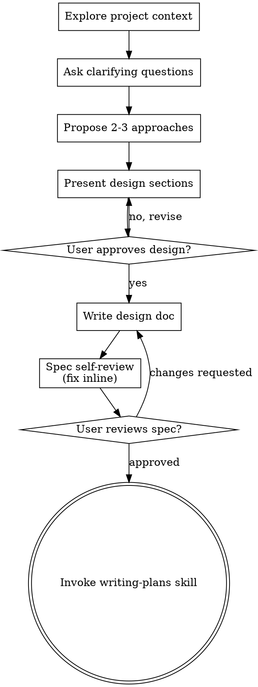

# Brainstorming Ideas Into Designs

Turn ideas into fully formed designs and specs through collaborative dialogue. Start from project context, ask questions one at a time, then present the design and get approval.

<HARD-GATE>
Do NOT invoke any implementation skill, write any code, scaffold any project, or take any implementation action until you have presented a design and the user has approved it. This applies to EVERY project regardless of perceived simplicity.

Before proposing any design that adds or changes scripts, manifests, tests, generated artifacts, or documentation, you MUST explicitly lock these decisions with the user:

1. **Single source of truth**
   - Decide which file owns the workflow-level documentation.
   - Do not split the same operational guidance across README, scripts, tests, and docs unless each has a clearly different purpose.

2. **Minimum runtime contract**
   - Any manifest, CSV, JSON schema, interface, or CLI surface must default to the minimum fields and arguments required by the current runtime path.
   - Extra traceability or convenience fields must be explicitly justified and approved.
   - When the real contract is one concrete file or directory location, prefer a direct path over split abstractions like base-path-plus-version unless both layers are independently meaningful and user-visible.

3. **Documentation boundaries**
   - READMEs may describe workflows and relationships between tools.
   - Scripts and tests must document only their own purpose, inputs, outputs, and local assumptions.
   - Scripts and tests must not be treated as cross-referenced workflow documentation unless explicitly requested.

4. **Naming scope**
   - If the mechanism is intended to be reusable across technologies, products, or repos, prefer generic names.
   - If it is intentionally narrow, use specific names.
   - This must be decided before implementation.

5. **Temporary workaround policy**
   - If a workaround is less readable than the ideal design, call it out explicitly before using it.
   - Add a short TODO describing the preferred long-term fix in simple terms.
</HARD-GATE>

## Anti-Pattern: "This Is Too Simple To Need A Design"

Every project goes through this process. A todo list, a single-function utility, a config change — all of them. "Simple" projects are where unexamined assumptions cause the most wasted work. The design can be short (a few sentences for truly simple projects), but you MUST present it and get approval.

## Checklist

You MUST create a task for each of these items and complete them in order:

1. **Explore project context** — check files, docs, recent commits
2. **Ask clarifying questions** — one at a time, understand purpose/constraints/success criteria
3. **Lock contract and documentation ownership** — source of truth, minimum runtime schema, naming scope, workaround policy
4. **Propose 2-3 approaches** — with trade-offs and your recommendation
5. **Present design** — in sections scaled to their complexity, get user approval after each section
6. **Write design doc** — save to `docs/superpowers/specs/YYYY-MM-DD-<topic>-design.md`
7. **Spec self-review** — quick inline check for placeholders, contradictions, ambiguity, scope (see below)
8. **User reviews written spec** — ask user to review the spec file before proceeding
9. **Transition to implementation** — invoke writing-plans skill to create implementation plan

## Process Flow

**The terminal state is invoking writing-plans.** Do NOT invoke frontend-design, mcp-builder, or any other implementation skill. The ONLY skill you invoke after brainstorming is writing-plans.

## The Process

**Scope check first:** If the request describes multiple independent subsystems (e.g., "build a platform with chat, file storage, billing, and analytics"), flag this before asking detailed questions. Help the user decompose into sub-projects: what are the independent pieces, how do they relate, what order should they be built? Then brainstorm the first sub-project through the normal design flow. Each sub-project gets its own spec → plan → implementation cycle.

**Asking questions:**
- One question per message; prefer multiple choice when possible, open-ended is fine otherwise
- Focus on purpose, constraints, success criteria

**Exploring approaches:** Propose 2-3 options with trade-offs. Lead with your recommendation and explain why.

**Presenting the design:**
- Scale each section to its complexity: a few sentences if straightforward, up to 200-300 words if nuanced
- Ask after each section whether it looks right so far
- Cover: architecture, components, data flow, error handling, verification
- Only turn verification into a concrete automated testing/TDD plan when the human explicitly asks for tests or the project already depends on them
- For work involving scripts, manifests, tests, or generated artifacts, include a short section that states:
  - source of truth for workflow documentation
  - minimum runtime contract
  - whether a direct path or layered path abstraction is justified
  - what belongs in README vs script/test docstrings
  - whether naming is generic or task-specific

**Design for isolation and clarity:**

- Break the system into smaller units that each have one clear purpose, communicate through well-defined interfaces, and can be understood and verified independently
- For each unit, you should be able to answer: what does it do, how do you use it, and what does it depend on?
- Can someone understand what a unit does without reading its internals? Can you change the internals without breaking consumers? If not, the boundaries need work.
- Smaller, well-bounded units are also easier for you to work with - you reason better about code you can hold in context at once, and your edits are more reliable when files are focused. When a file grows large, that's often a signal that it's doing too much.

**Working in existing codebases:**

- Explore the current structure before proposing changes. Follow existing patterns.
- Where existing code has problems that affect the work (e.g., a file that's grown too large, unclear boundaries, tangled responsibilities), include targeted improvements as part of the design - the way a good developer improves code they're working in.
- Don't propose unrelated refactoring. Stay focused on what serves the current goal.

## After the Design

**Documentation:**

- Write the validated design (spec) to `docs/superpowers/specs/YYYY-MM-DD-<topic>-design.md`
  - (User preferences for spec location override this default)
- Use elements-of-style:writing-clearly-and-concisely skill if available

**Spec Self-Review:**
After writing the spec document, look at it with fresh eyes:

1. **Placeholder scan:** Any "TBD", "TODO", incomplete sections, or vague requirements? Fix them.
2. **Internal consistency:** Do any sections contradict each other? Does the architecture match the feature descriptions?
3. **Scope check:** Is this focused enough for a single implementation plan, or does it need decomposition?
4. **Ambiguity check:** Could any requirement be interpreted two different ways? If so, pick one and make it explicit.

Fix any issues inline. No need to re-review — just fix and move on.

**User Review Gate:**
After the spec review loop passes, ask the user to review the written spec before proceeding:

> "Spec written to `<path>`. Please review it and let me know if you want to make any changes before we start writing out the implementation plan."

Wait for the user's response. If they request changes, make them and re-run the spec review loop. Only proceed once the user approves.

**Implementation:**

- Invoke the writing-plans skill to create a detailed implementation plan
- Do NOT invoke any other skill. writing-plans is the next step.

## Key Principles

- **YAGNI ruthlessly** — remove unnecessary features from all designs
- **One question at a time, multiple choice preferred** — don't overwhelm
- **Incremental validation** — present design, get approval before moving on
- **Be flexible** — go back and clarify when something doesn't make sense
